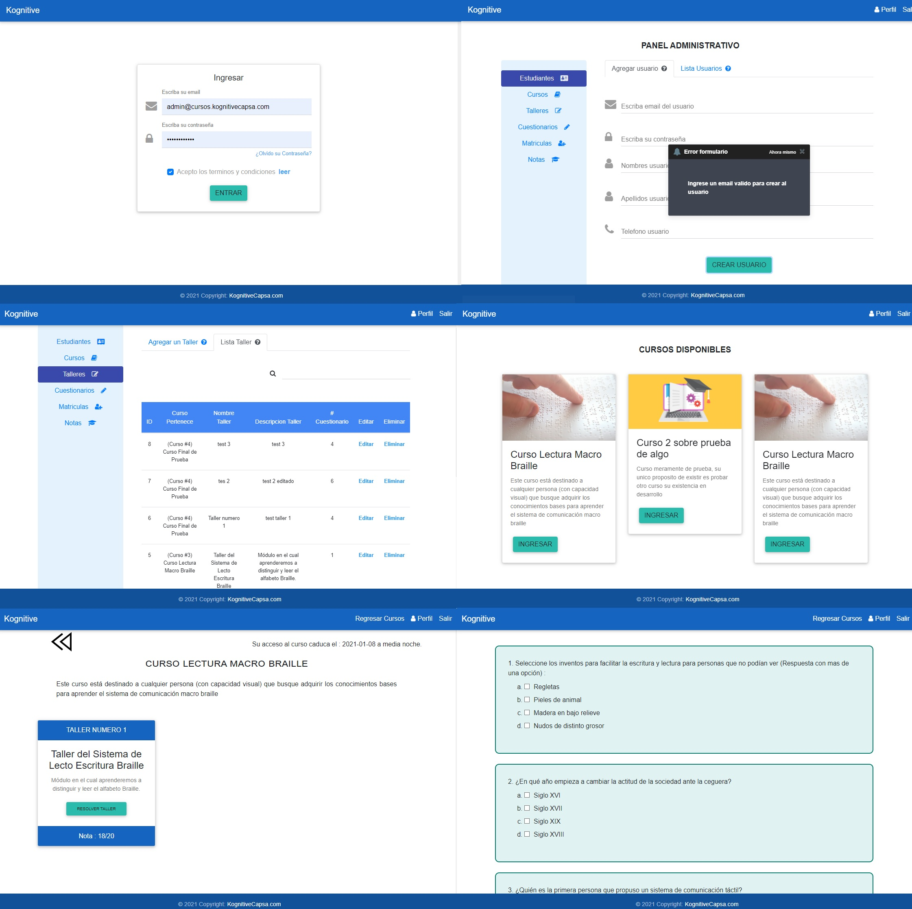

## Informacion Proyecto
En este proyecto se tiene un sistema de Gestion de cursos desde un panel administrativo donde se podra matricular estudiantes, mirar sus notas, eliminarlos, mirar quienes se logearon o quienes no, se podra recuperar la contraseña por email, asi como cambiar informacion en el perfil de cada usuario. 
Por otra parte tambien se puede crear cursos, cada curso tiene dentro talleres, los cuales tambien se pueden crear, y cada taller tiene dentro cuestionarios, materiale didacticos y videos educativos, todos estos son editables, eliminables, y paginados en un buscador facil de usar, cabe señalar que cada curso tiene una caducidad por fecha para cada usuario lo cual se configura tambine desde el panel administrativo.  
Desde el punto de vista de un usuario se podra ingresar al perfil ver los datos, modificar, cambiar la contraseña, ingresar a un curso, resolver un taller, mirar notas, recibir la nota por correo electronico asi como la url para restaurar la contraseña si la solicitara.

## Configuracion Desarrollo

Existen archivos o variables que se usan en desarollo de cierta manera aqui se enumeran a continuacion los cambios para produccion, para desarrollo es lo contrario  
--constant_class para produccion IP_SERVIDOR_PETICIONES_PHP va en blanco "", para desarrollo la url de donde se alojo el contenido de /server_apache_code/, puede ser un servidor local o una url de uno en la red 
--cookies tienen que ser puestas con secure en true para produccion, y false para desarrollo 
--base_loginSystem tiene que ser puesto en false el debuger para no ver debugs en consola en produccion 
--apis/config.php en config servidor modo_produccion debe ponerse en true, y asi solo aceptara el logeo con verificacion de access token para produccion, se pone en false para     probar en desarrollo con servidores locales 
--apis/config.php tambien se encuentran las credenciales de mysql que deben ser colocadas para que funcione el back-end y conecte correctamente 
 

## Info Backend

El backend esta en php sobre apache y la base de datos sobre mysql, es necesario seguir los pasos para reconstruir el back-end del proyecto

## Compilador

Este proyecto se compila con WebCompiler, otro proyecto de git ya tiene configurado dicho compilador, en este unicamente es de desarollo

 

## Notas

Se repararon varias vulneravilidades del proyecto y se actualizo paquetes a sus ultimaz versiones, el compilador debe ser realizado los mismos cambios 
Dentro del server_apache_code en apis, hay algunos php que no se llaman de ninguna parte desde el cliente con react, siendo las siguientes
 -regenerate_tokens.php
 -delete_token_restore_old.php 
La razon es que son Cron task que deben correr en un servidor

This project was bootstrapped with [Create React App](https://github.com/facebook/create-react-app).

## Pasos para usar el proyecto

1 - Clonar el proyecto
2 - Asegurarse de tener nodejs instalado para correr comandos npm
3 - Situarse dentro de la carpeta master raiz y correr el comando npm install
4 - Correr el comando npm install yarn
5 - Correr el comando yarn start
6 - Aqui estara en modo desarrollo para modificar o pruebas, para pasar a produccion deberia correr yarn build y tomar el contenido que se genero dentro de la carpeta build y colocarlo en el direccio raiz   de ese dominio o sudominio
7 - Copiar contenido de /server_apache/ a la misma carpeta del paso 6
8 - Dependiendo de si esta en produccion o desarrollo configurar los primeros pasos de este Readme
9 - Importar de /data_base_for_import/ el sql que contiene la estructura de la base de datos mysql
10 - Crear un administrador para ello correr el script php creando_user.php, si estubiera en un servidor local seria algo como esto http://localhost/apis/creando_user.php, se coloca esa direccion en el navegador se presiona enter y veriamos como se creo el administrador, se recomienda borrar ese php despues del proceso ya que es el unico que no cuenta con ninguna seguridad o validacion para la db, es unicamente para crear el admin en este paso.
11 - Probar a crear usuarios, cursos, talleres, notas, etc.

## Scripts disponibles

En el direcctorio del proyecto puedes correr:

### `yarn start`

Corre la aplicacion en modo de desarollo. 
Abre [http://localhost:3000](http://localhost:3000) para ser visto en el navegador.

La pagina se recargara cuando la edites. 
Tambien veras errores de tenerlos en la consola.

### `yarn build`

Construye la aplicacion y la compila para produccion situandola en la carpeta `build`. 
It correctly bundles React in production mode and optimizes the build for the best performance.
